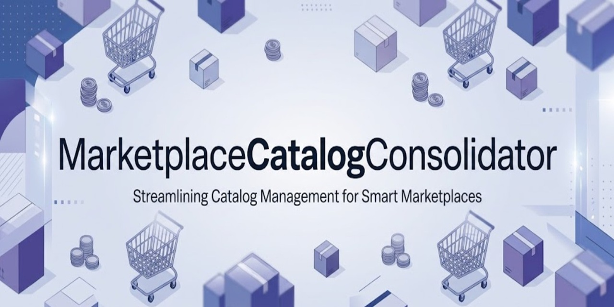

# Marketplace Catalog Consolidator

[](https://github.com/samuel-santos-engineer/MarketplaceCatalogConsolidator/milestones)
[](tests)
[](https://github.com/samuel-santos-engineer/MarketplaceCatalogConsolidator/actions/workflows/ci.yml)
[](https://dotnet.microsoft.com/download/dotnet/10.0)
[](Dockerfile)
[](LICENSE)

Marketplace Catalog Consolidator is a .NET 10 API for consolidating seller product catalogs into a canonical SQLite catalog. The project is being delivered incrementally against [the solution design](docs/MarketplaceCatalogConsolidator-Solution-Design.md). Milestone 9 adds a public UUID v4 generator to the existing upload, lab reset, public read, Swagger, and operational features. Docker/Azure work is reserved for the final deployment milestone.

## Architecture

```text
API (composition root) -> Application -> Domain
API -> Infrastructure (Application ports implemented here)
UnitTests -> Domain + Application
IntegrationTests -> Infrastructure
```

The API project is the composition root and may reference Infrastructure for dependency registration. Application contains use cases and provider-neutral ports, Domain contains business rules and entities, and Infrastructure owns SQLite and file-system adapters. Unit and integration tests are kept in separate projects. The intended runtime uses one API instance and one serialized consolidation worker, with the working database, upload staging, and immutable reports persisted under `/home/data`.

## Current status

The solution targets `net10.0` and includes API, Application, Domain, Infrastructure, UnitTests, and IntegrationTests projects. The API exposes nine versioned routes documented below. Startup initializes storage under the shared workflow gate, completes any interrupted lab reset, applies migrations, recovers interrupted uploads, and resumes pending report finalizations before running the host. One hosted consolidation worker polls at a bounded interval and uses the data-root gate plus an atomic SQLite claim to serialize work across service instances sharing that root. The production item processor validates and cleans source entries, preserves valid brand/category values, strictly matches products, writes seller offers, and commits each item outcome atomically with its catalog changes. Terminal outcomes are persisted only after an immutable report is published and verified.

The `artifacts/catalog.db` is an immutable assessment input and must remain unchanged. Bootstrap copies it to a separate working database before migration. The supplied database has 975 `Product` rows and no `SellerProduct` links; migration preserves legacy seller rows and changes `SellerProduct.SellerProductId` to `TEXT NOT NULL`. For seller rows from older schemas, newly required audit fields unavailable in the source are marked with a deterministic `legacy:<row-id>` fingerprint and the Unix epoch timestamp. Migration history is stored in `SchemaMigration`, and product identity keys are normalized for matching. `ProductEntry.json` contains 269 entries.

Source cleaning is centralized in `SourceTextCleaner`: preserve Unicode letters/digits, Unicode punctuation, and visible ASCII (including quotes, apostrophes, hyphens, and decimal points), remove other characters, and collapse whitespace. Unicode dashes and curly quotes remain intact; strict matching keeps `AB–12` distinct from `AB12`, without fuzzy merging. Category alias `Photo` becomes `Photography`, and source GUIDs use canonical D format. Valid seller names, brands, and categories remain intact even when absent from the catalog. Accepted items are `Approved` when all reported values remain unchanged and `Cleaned` when any value changes. Cleaning actions show the changed field and final value, for example `Name: Smartphone Galaxy S23 Linked seller FitnessCenter to existing product 2.` Raw fields preserve the original input, and JSON may encode quotes as `\u0022` or apostrophes as `\u0027` without changing their values.

## Product matching

Product-name comparison keys ignore exactly one trailing ASCII double quote when it immediately follows a digit, treating that quote as an optional inch marker. Thus `Tablet iPad Pro 12.9` and `Tablet iPad Pro 12.9"` can link to the same product; brand and category still match strictly. Internal quotes, repeated quotes, curly quotes, apostrophes, and other punctuation remain significant. The exception changes comparison keys only: it does not rewrite source or canonical display values or mark an otherwise unchanged item `Cleaned`. Migration refreshes existing working-database keys without merging existing rows or rewriting historical reports; if multiple rows now share an identity, lookup selects the lowest product ID.

### Matching safety and identifier policy

The current input contract contains `Id`, `SellerName`, `Name`, `Brand`, and `Category`; it supplies no EAN, UPC, ISBN, or manufacturer part number (MPN). `Id` identifies a seller's source offer, not a globally unique product. The combination of cleaned seller name and canonical source ID prevents duplicate offers; a repeated pair is rejected as a duplicate or, when its original content differs, a source-ID conflict. Upload `Idempotency-Key` identifies a request and is also not a product identifier.

Automatic product matching requires equality of normalized **Brand + Name + Category**, including the narrowly scoped optional inch-marker rule above. Missing brand or category prevents matching: an otherwise valid item creates a separate product rather than guessing an identity. Valid unfamiliar brands and categories are preserved, not discarded. This deliberately favors a false negative (a duplicate product requiring later review) over a false positive (incorrectly joining distinct products and their seller offers). Generation and capacity differences such as Galaxy S22/S23 and iPhone 13 128GB/256GB remain significant and have consolidation regression tests. No fuzzy string-distance algorithm participates in automatic merging. A future fuzzy feature may suggest candidates to a human reviewer, but must not write product merges or seller reassociations without explicit review approval and an audit trail.

If standard product identifiers are added, the proposed deterministic precedence is:

1. Validated EAN/UPC, converted to a common barcode comparison key using an explicitly specified validation and equivalence policy.
2. Validated ISBN, using an explicitly specified format/equivalence policy and preserving edition/format distinctions.
3. An exact manufacturer-scoped MPN together with normalized brand; do not strip significant part-number punctuation.
4. The current normalized Brand + Name + Category key, only when no standard identifier is supplied.

This is a future policy, not implemented identifier support. A unique identifier match would take precedence over text similarity, but conflicting identifiers, multiple candidate products, or incompatible model/capacity evidence must stop automatic linking and go to review. A supplied invalid or unmatched identifier must not silently fall back to a text match; after validation, an unmatched identity may create a separate product. Before enabling this policy, extend the input/storage contracts and add tests for precedence, equivalent representations, identifier conflicts, manufacturer scoping, missing/invalid values, and preservation of distinct variants.

## Prerequisites

- .NET SDK 10.0.103 baseline (pinned by `global.json`, with .NET 10 feature-band roll-forward enabled)
- Gitleaks 8.30.1 for local secret scanning; CI downloads the pinned native binary without secrets
- Docker is needed only for the final deployment milestone

## Local development

Build and test the solution:

```sh
dotnet build MarketplaceCatalogConsolidator.sln
dotnet test MarketplaceCatalogConsolidator.sln
```

Startup requires a non-empty `Security__ApiKey` supplied through the runtime environment. Production should use a unique high-entropy value. Missing credentials, a production development-placeholder, an unavailable starter database, or a working root that would overwrite the starter fail startup with a generic configuration message.

For a local demonstration only, this explicitly enabled Development convention uses the public placeholder `development-only-not-a-secret`:

```powershell
$env:ASPNETCORE_ENVIRONMENT = 'Development'
$env:Development__UsePlaceholderApiKey = 'true'
dotnet run --project src/MarketplaceCatalogConsolidator.Api --no-launch-profile --urls http://localhost:5254
```

[.env.development.example](.env.development.example) documents the convention; .NET does not load that file automatically. Paste the public placeholder into the upload header only for local Development. The convention and placeholder are rejected outside Development. For other environments, supply `Security__ApiKey` through protected environment/App Service settings, not committed files. Explicit runtime keys override the Development placeholder.

With the runtime environment configured, run the API host:

```sh
dotnet run --project src/MarketplaceCatalogConsolidator.Api
```

Swagger UI is public at `/swagger/`; the OpenAPI document is at `/openapi/v1.json`. `POST /api/v1/uploads` accepts exactly one `file` part containing a UTF-8 JSON array, strictly smaller than 500,000 bytes, and requires `Idempotency-Key` (UUID v4) plus `X-Api-Key`. The API key is supplied through `Security__ApiKey` configuration/environment only and is compared in constant time. A newly accepted upload returns `202 Accepted` with upload ID, current status, display filename, SHA-256, and a `Location` header pointing to the live `/api/v1/uploads/{uploadId}/status` endpoint. Missing or invalid credentials return the same `401` response. Invalid multipart/JSON or idempotency headers return `400`, content types other than multipart return `415`, oversized files return `413`, and a reused idempotency key with different bytes returns `409`. Every error has `traceId`, `code`, and `message`. Repeating a key with identical bytes returns the same upload. The background worker handles accepted uploads and writes their immutable report. Do not commit local environment files or secret-bearing settings.

## Public random UUID (Milestone 9)

`GET /api/v2/random-uuid` returns a fresh RFC 4122 UUID v4 generated server-side by `Guid.NewGuid()` in canonical lowercase D format. It accepts no API-key header, body, or query parameters and accesses no storage/database. It uses the existing public-read rate limit and security/error middleware (`200`, `429`, safe `500`).

```powershell
Invoke-RestMethod -Uri 'http://localhost:5254/api/v2/random-uuid'
```

Example response: `{ "uuid": "9d0df985-610c-4e54-8d50-519e972a42a6" }`. Each request generates a new value; you can use it as the UUID v4 upload `Idempotency-Key`.

## Destructive lab reset (Milestone 8)

`POST /api/v2/reset-database` is an authenticated lab-only operation that permanently removes upload history/outcomes, idempotency records, staged files, reports, and seller links. It copies the immutable starter catalog into the working database and reapplies normal migrations, restoring 975 products and zero seller links. The running service remains usable, readiness returns healthy, and a new upload can be accepted immediately. Production deployment must disable/remove this endpoint or require a separate intentional production decision; this milestone does not authorize production use.

For local Development only, with the placeholder convention above explicitly enabled:

```powershell
Invoke-RestMethod -Method Post -Uri 'http://localhost:5254/api/v2/reset-database' -Headers @{
    'X-Api-Key' = 'development-only-not-a-secret'
    'X-Reset-Confirmation' = 'RESET_DATABASE'
}
```

Send no body. `X-Reset-Confirmation` must equal `RESET_DATABASE` exactly, including case. Missing/invalid authentication returns `401 unauthorized`; missing/wrong confirmation returns `400 reset_not_confirmed`; a non-empty body (including chunked input) returns `400 invalid_request_body`. The response is `200` with `resetAtUtc`, `productCount: 975`, and `sellerProductCount: 0`. Reset shares the upload mutation rate-limit bucket (5 requests/minute/peer, `429` on excess), never the public-read bucket. Global body limits and safe `500`/`503` error envelopes remain in effect.

Worker processing, upload persistence/staging, report publication, startup initialization, storage reads, and reset cooperate through the existing exclusive data-root workflow gate. Reset waits for in-flight work to finish; operations arriving during reset wait, then act on the clean state. Uploads accepted before a completed reset are intentionally erased; uploads waiting behind it are accepted into the clean database. Request cancellation cancels waiting, but once destructive mutation begins initialization finishes independently of a client disconnect. A failed reset returns `503 reset_failed`, retains a durable recovery marker, makes readiness and uploads return `503 maintenance_unavailable`, and keeps the host/worker alive. Retrying reset or restarting redoes initialization before normal work resumes.

Use this endpoint instead of deleting a running service's storage folder: it preserves the working root and held lock artifact, cleans SQLite sidecars and managed flat staging/report directories under the gate, preserves the starter database, and applies migrations before success. Unexpected nested/linked artifact directories fail closed. Existing downloaded reports are not rewritten. Swagger documents only the versioned POST and both required headers, with no secret example.

## Public read API (Milestone 6)

All GET routes below are public and require no API-key header. In Swagger, expand a GET operation and select **Try it out**; both upload and lab-reset POST operations need credentials.


| Route | Queries and response |
| --- | --- |
| `GET /api/v1/uploads` | Optional `status`, `page=1`, `pageSize=25`. Returns upload attempts ordered by start time descending, then ID descending. |
| `GET /api/v1/uploads/{uploadId}/status` | `page=1`, `pageSize=50`. Returns upload metadata, trace ID, safe failure details, and items ordered by source index. |
| `GET /api/v1/uploads/{uploadId}/report` | Downloads the immutable final report as `application/json`. |
| `GET /api/v1/catalog` | Optional category, brand, name, and seller filters; page defaults to 1 and page size to 25. |
| `GET /api/v1/health` | Returns `200` without database or filesystem checks. |
| `GET /api/v1/ready` | Returns `200` when SQLite and storage are available; otherwise `503`. |

Pagination responses contain `items`, `pageNumber`, `pageSize`, and `totalCount`. Pages must be positive integers; page size is 1–100 on all paginated routes. Invalid values return `400 invalid_pagination`; an unsupported upload-state filter returns `400 invalid_status`. Pages beyond the result set return an empty `items` array. Offset pagination is stable for unchanged data; new uploads or catalog changes can move subsequent pages.

Upload metadata includes `uploadId`, display `fileName`, `status`, start/completion timestamps, summary counts (`received`, `approved`, `cleaned`, `rejected`), and `reportAvailable` based on finalized durable metadata. Status items include source index/ID, raw seller/name/brand/category, cleaned values, outcome, action taken, and canonical product ID. Public projections exclude idempotency keys, staging/report paths, and internal diagnostics. Report-generation retries remain visible as `ReportPending`, without exposing their exception details.

Catalog category/brand/seller filters match whole values; product name matches a literal substring. All filters ignore case, accents, and leading/trailing/repeated whitespace; blank filters are omitted. Queries use bound SQLite parameters, so `%`, `_`, and SQL-looking text remain literal input. A product appears once regardless of seller count. With `sellerName`, only matching offers are returned; otherwise all offers are returned in offer-ID order. Offers expose only seller name and seller source-product ID.

Unknown or invalid upload IDs return `404 upload_not_found` with the standard envelope. Reports return `409 report_not_available` while queued, processing, or report-pending. Terminal reports require complete durable metadata, the expected generated path, matching SHA-256, valid JSON, and the expected upload identity/state. Missing, corrupt, or misdirected terminal reports return a safe `500 report_unavailable` and structured log evidence; this route never repairs or regenerates a report. It verifies and buffers the exact file bytes before sending them. Availability flags do not perform per-row filesystem checks; download verifies the file itself.

Example public queries:

```http
GET /api/v1/uploads?status=Completed&page=1&pageSize=25
GET /api/v1/catalog?category=Electronics&brand=Samsung&name=Galaxy&page=1&pageSize=25
GET /api/v1/health
GET /api/v1/ready
```

Configuration keys:


| Environment variable | Purpose |
| --- | --- |
| `Security__ApiKey` | Required upload credential; never place in source control, logs, reports, query strings, or OpenAPI examples. |
| `Development__UsePlaceholderApiKey` | Explicit opt-in to the public local placeholder, accepted only in Development. |
| `Catalog__StorageRoot` | Persistent data root for the working catalog, staged uploads, and reports. |
| `Catalog__StarterDatabasePath` | Optional path to the immutable starter database. |
| `ASPNETCORE_HTTP_PORTS` | HTTP listener port; the container baseline uses `8080`. |

Infrastructure consumers can use `FileSystemStoragePaths`, `SqliteWorkingDatabaseBootstrapper`, and `SqliteDatabaseMigrator` to initialize storage. At startup, `Processing` uploads return to `Queued` while their committed item outcomes remain persisted; the worker skips those indexes when resuming. Each valid item's product change, seller link, and `UploadItem` result share one transaction. When processing finishes, durable counts and intended outcome are stored as `ReportPending`; the report is atomically published, read back, and hashed before the upload receives its terminal state. Report failures remain retryable. For local upload testing, set `Security__ApiKey` in the shell environment. The deployed app must be HTTPS-only at its ingress.

## Database design and growth

### Transaction policy

Each accepted item's product lookup/create, `SellerProduct` association, and persisted `UploadItem` outcome commit together in one SQLite transaction. A storage failure rolls back that item's writes, so it cannot leave a partial product or seller link. Independent per-item transactions intentionally retain earlier committed progress: a rejected item does not undo valid items, and recovery skips source indexes whose outcomes are already durable. For this bounded lab upload, restart recovery and useful partial results outweigh rolling back the entire file. Summary counts and immutable report finalization occur after item processing and remain retryable independently.

One all-or-nothing file transaction is an alternative business policy, not an omitted safeguard. It would require explicit batch acceptance/rollback semantics and a revised recovery/report design, while holding the write transaction across the whole import. The current policy permits partial success; it does not promise whole-file atomicity.

### Indexed lookup and growth path

Consolidation uses stored comparison keys and parameterized equality on `(NormalizedBrand, NormalizedName, NormalizedCategory)`, supported by `IX_Product_NormalizedIdentity`; matching does not normalize and scan every catalog row for each source item. Lookup selects the lowest product ID if existing rows share an identity. The index is non-unique: this is not a database-wide guarantee that historical duplicates are absent. Maintaining comparison columns and the index adds storage and write/migration work, but avoids repeated normalization of the catalog during strict matching. The starter has 975 products and the supplied input has 269 entries; no production-scale throughput claim is made.

Public catalog search is a different query path: it currently applies `public_normalize` to display fields, uses a literal substring predicate for names, and returns offset-based pages. The identity index does not make those expressions or arbitrary substring searches efficiently indexed. This simple approach is suitable for the current bounded dataset; larger workloads require measured query plans, latency, and pagination costs before changing the design. Possible improvements include separately indexed normalized search fields, seller-filter indexes, and keyset pagination. Search normalization must remain separate from product-identity rules such as the optional inch marker.

SQLite fits the current local/lab deployment: one working database, a serialized worker/maintenance gate, and short item transactions. A future move to PostgreSQL would keep the Application ports and strict matching contract while replacing the storage adapters and migrations. That migration must explicitly preserve normalization, foreign keys, seller/source-ID uniqueness, request idempotency, and item/outcome atomicity. Multiple workers would also require database-coordinated claims and locking plus a revised shared-artifact/report design; changing the database alone is not scale-out. Validate legacy duplicate and incomplete identities before adding any stronger product-identity uniqueness constraint.

As catalog-search needs grow, evaluate relational indexes first, then PostgreSQL full-text or trigram search, or a dedicated search index with an explicit synchronization strategy. These are future discovery/review options, not implemented dependencies or automatic merge rules. Vector search is not required for the current deterministic product-matching contract; neither fuzzy nor semantic search should override strict identity automatically.

## Verification

All changes follow **feature branch -> pull request -> user review -> user merge to main**. Do not push project code directly to `main`, merge on the user's behalf, or enable auto-merge. See [CONTRIBUTING.md](docs/CONTRIBUTING.md) and [SECURITY.md](docs/SECURITY.md). Repository guidance and the manual PR template are in [AGENTS.md](docs/AGENTS.md) and [pull_request_template.md](docs/pull_request_template.md).

Run the repository verification script from the repository root:

```powershell
powershell.exe -NoProfile -ExecutionPolicy Bypass -File .\scripts\verify.ps1
```

```sh
sh scripts/verify.sh
```

These scripts restore, build Release, run tests (including workflow-YAML parsing), and check formatting without modifying source. CI runs the verifier and a separate credential-free secret-scanning job on pushes and PRs. Gitleaks 8.30.1 uses default rules plus generated-output exclusions in `.gitleaks.toml`; source, tests, examples, and documentation remain scanned. The scanner download is checked against its release checksums. CI scans both checkout contents and complete Git history without a license/token secret or Python tooling.

Run the same checkout scan locally:

```powershell
gitleaks dir . --config .gitleaks.toml --redact --no-banner
# Once the checkout has Git history:
gitleaks git . --config .gitleaks.toml --redact --no-banner
```

## Operational hardening (Milestone 7)

Uploads use a fixed window of **5 requests per minute per connection peer**; the six public read routes and OpenAPI share a separate **120 requests per minute** policy. No requests queue. Rejections return `429 rate_limit_exceeded` with the standard error envelope and `Retry-After` when provided by the limiter. Invalid/unauthorized requests also consume permits, and rate rejection happens before parsing or staging. The peer comes from the server connection; arbitrary `X-Forwarded-For` headers do not influence partitions. Automatic forwarded-header trust must remain disabled. A future deployment must explicitly review trusted proxies; shared ingress peers may share a bucket. Limits are per process, intended for the single-instance lab.

Kestrel and the upload-body wrapper cap the total multipart request at **532,768 bytes**, allowing multipart overhead while independently enforcing the existing file limit of **499,999 bytes**. Declared and streamed sizes are checked. Global exceptions return a generic `500 internal_error` envelope with a trace ID. Application error logs include exception type and trace/upload IDs, not exception messages, headers, keys, raw source bodies, or physical paths. No request-body/header logging is enabled; framework informational request logs are disabled by the default logging configuration.

Responses include `X-Content-Type-Options: nosniff`, `X-Frame-Options: DENY`, `Referrer-Policy: no-referrer`, and a restrictive camera/microphone/geolocation permissions policy. HTTPS responses also receive HSTS. No CSP is imposed on the CDN-backed Swagger page, preserving its current behavior. HTTPS enforcement remains the deployment ingress's responsibility.

## Docker

Build and run the non-root baseline image:

```sh
docker build -t marketplace-catalog-consolidator:local .
docker run --rm -p 8080:8080 -v marketplace-data:/home/data marketplace-catalog-consolidator:local
```

The runtime image baseline uses the .NET 10 ASP.NET base image, listens on port `8080`, and runs as UID/GID `10001`. Persistent storage is mounted at `/home/data`. Image build/run/inspection/verification is intentionally deferred to the final Azure deployment milestone and was not performed for Milestone 7. CI has no image jobs.

## Azure deployment

The target is Azure App Service Linux F1 in West Central US, running the published Docker image. Configure persistent storage for `/home/data`, set `Security__ApiKey` through App Service application settings, and require HTTPS at the App Service ingress. Keep the starter database immutable and ensure its working copy and all upload/report data remain on persistent storage. No cloud resources or deployments are created by this repository setup milestone.

## Known limitations

- Azure deployment remains future work. Process-local rate limits need review with the final ingress/proxy topology.
- Public pagination uses offsets; concurrent writes can shift page membership. Report downloads buffer verified bytes in memory, appropriate for this lab's bounded upload size.
- Azure App Service F1 storage persistence and capacity must be verified against the chosen hosting configuration before relying on it for production data.
