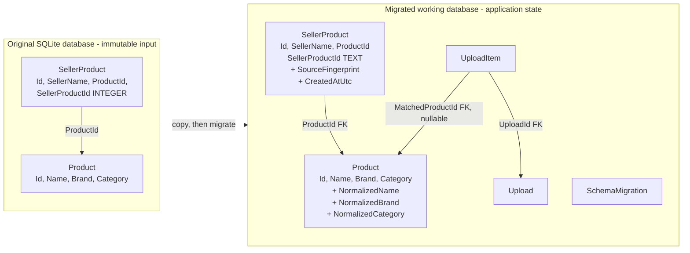

# Marketplace Catalog Consolidator - Database Design Decisions

## Purpose

This document explains how the supplied SQLite catalog is preserved, how its **working copy** evolves, and why each database decision was made. The goal is safe catalog consolidation: avoid duplicate master products while retaining the seller that offers each product.

The repository `artifacts/catalog.db` is an immutable input. The application never migrates it in place. At startup it copies that database into the configured working-data root, then applies forward migrations to the copy.

## Original and migrated schema



## Change summary

| Area | Original | Working-copy change | Reason |
|---|---|---|---|
| `Product` identity | Only display values | Adds three normalized comparison columns and a composite index | Detect equivalent products despite harmless text variation without changing the displayed catalog value. |
| `SellerProduct.SellerProductId` | `INTEGER` | Rebuilt as `TEXT NOT NULL` | Source product IDs are UUID-shaped strings, so an integer type would lose the source identity. |
| Seller-offer traceability | Seller/product relationship only | Adds fingerprint and creation timestamp | Detect repeated/conflicting source entries and preserve provenance. |
| Duplicate seller offer protection | No application uniqueness shown | `UNIQUE (SellerName, SellerProductId)` | A seller cannot create multiple links for the same source record. |
| Upload workflow | Not present | Adds `Upload` and `UploadItem` | Makes async ingestion, idempotency, restart recovery, status API, and immutable reports auditable. |
| Migration history | Not present | Adds `SchemaMigration` | Applies each database change once and supports repeatable startup. |

## 1. Preserve the supplied database; migrate a working copy

The supplied data is assessment input and a repeatable baseline. Altering it directly would make tests and demonstrations non-repeatable, and a failed migration could destroy the starting catalog.

The application therefore uses this sequence:

1. Keep repository `artifacts/catalog.db` read-only by convention.
2. Copy it to the configured data root.
3. Apply migrations to that copy in transactions.
4. Run with foreign-key enforcement enabled.

The lab reset endpoint repeats this sequence for the working copy only. It never resets or overwrites the repository asset.

### Alternative considered: migrate the supplied file in place

Rejected. It makes a second run depend on the result of the first, prevents an easy clean demonstration, and risks corrupting the provided input.

## 2. Add normalized product identity columns

The visible catalog attributes remain authoritative for presentation:

```text
Name:     Câmera Canon EOS R6
Brand:    Canon
Category: Photography
```

The migrated working copy also stores comparison keys:

```text
NormalizedName:     camera canon eos r6
NormalizedBrand:    canon
NormalizedCategory: photography
```

Normalization removes accents for comparison, uses a consistent case, and collapses leading/trailing/repeated whitespace. The application also applies the explicit category alias `Photo -> Photography` before matching.

For product-name identity only, one terminal ASCII double quote immediately following a digit is an optional inch marker. Comparison keys omit it without rewriting source or canonical display values; other punctuation remains significant. A versioned migration refreshes existing working-database keys without merging existing rows or rewriting reports, and lookup selects the lowest product ID if multiple existing rows share an identity.

Matching is strict on all three normalized values:

```text
NormalizedBrand + NormalizedName + NormalizedCategory
```

All three must be present. An entry with missing brand or category cannot merge with an existing master product merely because the name looks similar.

### Why store the keys instead of normalizing in every query?

- A composite index on `(NormalizedBrand, NormalizedName, NormalizedCategory)` gives SQLite an efficient deterministic lookup.
- It avoids recalculating functions for every existing catalog row during every import.
- It keeps the matching rule explicit, testable, and independent from the display formatting.
- It preserves the original/canonical `Name`, `Brand`, and `Category` values for APIs and reports.

### Alternatives considered

| Alternative | Decision | Trade-off |
|---|---|---|
| `LOWER(TRIM(...))` inside each lookup | Rejected | It handles too little variation and prevents a useful normalized-identity index. |
| Mutate display fields into lowercase/unaccented text | Rejected | It harms catalog presentation and loses the source/canonical form. |
| Fuzzy matching (Levenshtein/Jaro-Winkler) for automatic merges | Rejected | It can incorrectly merge variants such as Galaxy S22/S23 or storage-capacity variants. It is suitable only for a future human-review workflow. |
| A database `UNIQUE` constraint on normalized identity | Not used for the current migration | Existing input may contain incomplete identity values; SQLite NULL uniqueness semantics do not express the application’s strict matching policy cleanly. The processor enforces the policy and index supports it. |

## 3. Rebuild `SellerProduct` for source UUIDs and provenance

The original relationship table is retained conceptually: one master `Product` can be offered by multiple sellers. Its working-copy schema is rebuilt because SQLite cannot safely change an existing column type in place.

```text
SellerProduct
- Id                  INTEGER primary key
- SellerName          TEXT NOT NULL
- ProductId           INTEGER NOT NULL REFERENCES Product(Id)
- SellerProductId     TEXT NOT NULL
- SourceFingerprint   TEXT NOT NULL
- CreatedAtUtc        TEXT NOT NULL
- UNIQUE (SellerName, SellerProductId)
```

`SellerProductId` becomes `TEXT` because the supplied JSON identifies items with UUID strings. `SourceFingerprint` hashes the original Id, SellerName, Name, Brand, and Category values associated with that seller/source ID, not their normalized comparison keys. This distinguishes:

- a repeat of the same source entry - rejected as a duplicate;
- reuse of the same seller/source ID with changed content - rejected as a source-ID conflict;
- the same canonical product from a different seller - allowed and linked to the existing product.

Existing legacy rows are preserved during the rebuild. Where historic source fingerprint/timestamp information does not exist, the migration writes deterministic legacy values so the new non-nullable audit columns remain valid.

An index on `SellerProduct(ProductId)` supports reading seller offers for a catalog product.

## 4. Add foreign keys and verify referential integrity

The working copy adds or preserves these relationships:

| Child | Reference | Purpose |
|---|---|---|
| `SellerProduct.ProductId` | `Product.Id` | Every seller offer points to a real canonical product. |
| `UploadItem.UploadId` | `Upload.Id` with `ON DELETE CASCADE` | Item outcomes belong to exactly one upload attempt. |
| `UploadItem.MatchedProductId` | `Product.Id`, nullable | An approved/cleaned item can identify its resolved product; rejected items may have no match. |

The migration executes `PRAGMA foreign_key_check` before committing. A violation aborts the migration rather than leaving a partially valid working database.

## 5. Add upload and item-audit tables

Catalog changes alone are not enough for an asynchronous import API. The working copy adds:

```text
Upload
- Id, IdempotencyKey, FileName, FileHash
- StagedFilePath, ReportFilePath
- Status, StartedAtUtc, CompletedAtUtc
- outcome counts and safe failure/report-finalization metadata

UploadItem
- UploadId, SourceIndex, SourceProductId
- raw source values and cleaned values
- Status, ActionTaken, MatchedProductId
- PRIMARY KEY (UploadId, SourceIndex)
```

These tables support idempotent upload acceptance, persisted progress, restart recovery, a public status endpoint, and one immutable report per upload attempt. They are operational/audit data; they do not replace the `Product` and `SellerProduct` catalog model.

## 6. Use per-item transactions, not one transaction for the whole file

For each source item, the application writes the product decision, seller link, and `UploadItem` result in **one SQLite transaction**. If any part fails, none of that item’s changes remain.

This intentionally differs from wrapping the entire JSON file in one giant transaction.

| Choice | Benefit | Cost |
|---|---|---|
| Per-item transaction - selected | Durable progress, restart recovery, bounded write locks, and clear item-level Approved/Cleaned/Rejected reporting | A later failed item does not roll back previously committed valid items. |
| One transaction per file | Full all-or-nothing batch rollback | Long lock duration, no item-level durability during processing, and weaker restart behavior. |

For this bounded catalog-consolidation lab, per-item durability is the more useful failure model. The report records every outcome, so a partial import is explicit rather than hidden.

## 7. Record migrations explicitly

`SchemaMigration` is a small internal table:

```text
SchemaMigration
- MigrationId     TEXT PRIMARY KEY
- AppliedAtUtc    TEXT NOT NULL
```

Before applying a migration, startup checks whether its ID exists. A successful migration records its own ID in the same transaction. Repeated application startup then skips the completed migration.

This is especially important for SQLite because the database file persists across process restarts and deployments. It makes schema evolution repeatable without manually tracking which machine/database has which columns.

## 8. Security and operational decisions at the database boundary

- Every SQL command uses parameters. Source text is never concatenated into SQL.
- The suspicious SQL-control-sequence rule is a demonstrative data-validation policy; it is not the SQL-injection defense. Parameterized SQL is the defense.
- SQLite permits one writer at a time. A serialized worker and shared data-root maintenance gate coordinate uploads, report finalization, startup migration, and lab reset.
- The unique seller/source constraint and idempotency records make repeated requests converge safely.
- Reports are files outside SQLite, but their path/hash/finalization metadata is persisted so terminal status is set only after the report is atomically published and verified.

## 9. Scale path

SQLite is appropriate for the supplied catalog and a single-instance demonstration: it is zero-configuration, portable, and makes the migration/transaction behavior visible.

If catalog size, throughput, or concurrent writers grow materially, the next step is PostgreSQL. The data model, normalized identity keys, foreign keys, uniqueness rules, and application ports remain useful. The migration mechanism would change, and search/indexing could evolve based on actual query needs. Fuzzy or vector search should not become an automatic merge mechanism without an explicit human-review and false-positive policy.

## Decision outcome

The working schema stays relational and small:

- `Product` is the canonical marketplace product.
- `SellerProduct` records who offers it.
- Normalized keys provide safe deterministic duplicate detection.
- `Upload` and `UploadItem` provide durable operational evidence.
- `SchemaMigration` makes the changes repeatable.

The result favors explainability, data integrity, and repeatable demonstrations over premature production-scale complexity.
