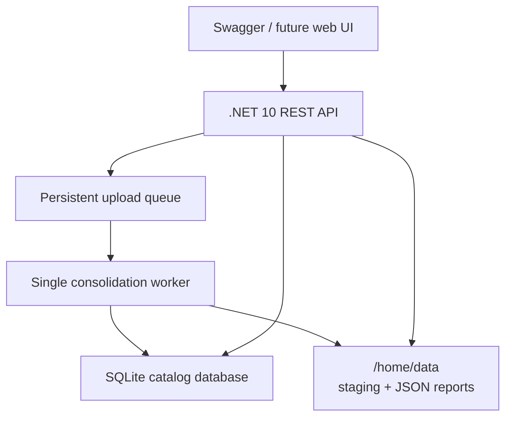
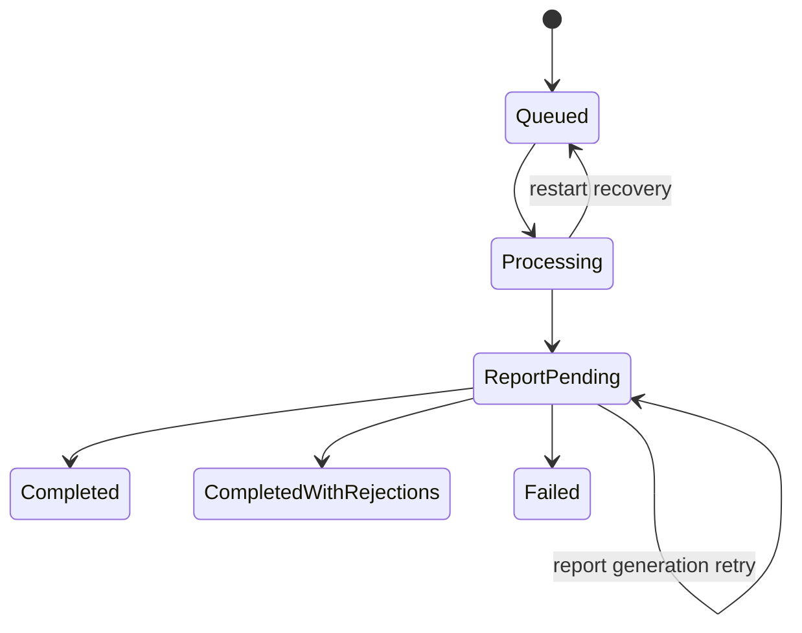

# Marketplace Catalog Consolidator - Solution Design

## 1. Purpose

**Marketplace Catalog Consolidator** is a public, containerized .NET 10 REST API lab. It accepts a seller-product JSON file, consolidates each entry into the supplied SQLite catalog, records seller offers without duplicating canonical products, and emits an immutable JSON report for every upload attempt.

GitHub repository: `MarketplaceCatalogConsolidator`

## 2. Scope and deployment

- Azure App Service Linux F1, West Central US.
- Docker image running a .NET 10 REST API.
- SQLite remains the catalog data store.
- Swagger/OpenAPI remains publicly available for reviewers.
- The catalog, upload history, staging files, and reports use persistent storage beneath `/home/data`.
- The application runs as one instance with one serialized consolidation worker. SQLite supports one writer at a time.



## 3. API contract

### Milestone 8: lab reset

Only `POST /api/v2/reset-database` resets storage. Require existing `X-Api-Key` authentication, exact case-sensitive `X-Reset-Confirmation: RESET_DATABASE`, and an empty body. Use the same mutation rate-limit bucket as uploads. Return `200` only after a fresh working copy of the immutable starter is migrated and verified (975 products, zero seller links), with `resetAtUtc`, `productCount`, and `sellerProductCount`. Errors are safe envelopes: `401 unauthorized`, `400 reset_not_confirmed`/`invalid_request_body`, global `413`, `429 rate_limit_exceeded`, `500 internal_error`, or `503 reset_failed`. OpenAPI documents both headers and the destructive lab-only consequence without credentials.

`ILabDatabaseResetService` orchestrates the existing data-root workflow gate; `ILabDatabaseResetStorage` owns filesystem/SQLite mechanics. Upload acceptance, worker transactions, report finalization, startup bootstrap/migrations/recovery, storage reads, and reset all cooperate. Competing work waits, then operates on the new state; active worker work finishes before reset proceeds. Normal requests honor cancellation while waiting; reset initialization completes independently of client disconnect once mutation starts. Clean only the managed working database/sidecars and flat staging/report directories. Preserve the root, gate artifact, and starter database. Validated targets must remain under the working root and exclude the starter. Linked/nested artifact directories fail closed.

A durable pending-reset marker blocks normal work and readiness after failure. The worker continues polling without stopping the host. Retrying reset or startup under the same gate restores a fresh migrated baseline and clears the marker only after verification. Upload history, item outcomes, idempotency records, reports, and staged inputs are removed. Unlike manually deleting a live storage folder, reset protects in-flight operations and preserves startup invariants. Production deployment must disable/remove the endpoint or make a separate intentional production decision. Local Development may use only the explicitly enabled public placeholder. The former duplicate root solution-design copy was consolidated into this document; keep documentation under `docs` except the root README.

Every REST endpoint uses URL-segment versioning. The initial release is `v1`; breaking changes introduce `v2` without changing `v1` behavior.


| Endpoint                                | Purpose                                 | Access  |
| ----------------------------------------- | ----------------------------------------- | --------- |
| `POST /api/v1/uploads`                  | Accept and queue one JSON upload        | API key |
| `GET /api/v1/uploads`                   | List upload attempts                    | Public  |
| `GET /api/v1/uploads/{uploadId}/status` | Upload metadata and item outcomes       | Public  |
| `GET /api/v1/uploads/{uploadId}/report` | Download the immutable JSON report      | Public  |
| `GET /api/v1/catalog`                   | Query the consolidated catalog          | Public  |
| `GET /api/v1/health`                    | Process liveness                        | Public  |
| `GET /api/v1/ready`                     | SQLite and persistent-storage readiness | Public  |
| `GET /api/v2/random-uuid`               | Generate a fresh RFC 4122 UUID v4        | Public  |

Milestone 9's UUID utility returns only `{ "uuid": "..." }`, generated server-side with `Guid.NewGuid().ToString("D")`. It requires no authentication, request body, or query parameters and accesses no storage/database or workflow gate. It uses the existing public-read rate limit and security/global-error middleware. OpenAPI names the operation `GenerateRandomUuid`, summarizes it as "Generate a random UUID v4", and documents only `200`, `429`, and safe `500` responses.

### 3.1 Upload endpoint

`POST /api/v1/uploads` accepts `multipart/form-data`.


| Input             | Rule                                                           |
| ------------------- | ---------------------------------------------------------------- |
| `file`            | Required JSON file, UTF-8, strictly smaller than 500,000 bytes |
| `Idempotency-Key` | Required RFC 4122 UUID v4                                      |
| `X-Api-Key`       | Required secret, configured only in Azure App Service settings |

The response is `202 Accepted` and contains `uploadId`, current state, display filename, and SHA-256, with a `Location` header pointing to the implemented public `/api/v1/uploads/{uploadId}/status` endpoint.

The same idempotency key and file SHA-256 return the existing upload rather than creating a second attempt. Reusing the key with another file returns `409 Conflict`. The database unique constraint and atomic create-or-get statement arbitrate concurrent same-key requests.

The upload API key is read from `Security__ApiKey` configuration/environment only and is compared in constant time. Missing or invalid credentials return the same `401` error envelope. The API accepts exactly one multipart file field named `file`; unsupported content types return `415`, invalid multipart/JSON or idempotency values return `400`, and files of 500,000 bytes or more return `413`. All errors use `{ "traceId", "code", "message" }`. Swagger UI is public at `/swagger/` and the OpenAPI document is `/openapi/v1.json`; credentials are never included in the specification.

Milestone 6 implements all seven routes in the API contract. Only the upload POST requires an API key. Upload history supports a named `status` filter, defaults to page 1/size 25, and orders by start instant descending then ID descending. Status defaults to page 1/size 50 for persisted items ordered by source index. All page sizes are limited to 100; invalid pagination returns the standard `400` envelope. Public projections exclude idempotency keys, physical paths, and internal diagnostics. Status returns `upload` metadata, trace ID, safe failure fields, and an `items` page.

Report downloads resolve the expected server-generated path through persisted metadata and verify the final SHA-256, JSON, upload identity, and terminal state before sending the exact original bytes as `application/json`. Unknown/invalid IDs return `404`; non-terminal or report-pending uploads return `409 report_not_available`; missing or invalid terminal reports return safe `500 report_unavailable` errors with structured logs. Download never generates a replacement. Report availability flags reflect finalized database metadata; file verification happens on download.

Health performs no dependency I/O. Readiness opens the existing working database in read/write mode without creating a replacement, verifies foreign-key enforcement, and probes both storage roots using temporary flushed files deleted on close. Failure returns `503 not_ready` without paths or exceptions.

### 3.2 Catalog endpoint

```text
GET /api/v1/catalog?category=&brand=&name=&sellerName=&page=1&pageSize=25
```

The endpoint returns canonical products, their seller offers, and pagination metadata (`items`, `pageNumber`, `pageSize`, `totalCount`). Page/size default to 1/25; size is capped at 100. Products use ID ascending and appear once even with multiple sellers. Category, brand, and seller name use whole-value matches; name uses literal substring matching. Filters ignore case, accents, and repeated whitespace; blank filters are omitted. Parameterized SQLite queries filter canonical values without modifying them. Seller filtering restricts returned offers to matching sellers; otherwise all offers are returned in offer-ID order. Offers expose seller name and seller source-product ID only. Offset page membership may shift during concurrent writes.

### 3.3 Error response

```json
{
  "traceId": "guid",
  "code": "invalid_json",
  "message": "The uploaded file is not a valid product-entry array."
}
```

The `traceId` appears in structured logs and in the final report.

## 4. Data model

The supplied database starts with 975 `Product` rows and an empty `SellerProduct` table. The design preserves these tables and evolves the schema through forward-only migrations.

### 4.1 Catalog tables

```text
Product
- Id                  INTEGER primary key
- Name                TEXT not null
- Brand               TEXT null
- Category            TEXT null
- NormalizedName      TEXT not null
- NormalizedBrand     TEXT null
- NormalizedCategory  TEXT null

SellerProduct
- Id                  INTEGER primary key
- SellerName          TEXT not null
- ProductId           INTEGER not null, foreign key to Product.Id
- SellerProductId     TEXT not null
- SourceFingerprint   TEXT not null
- CreatedAtUtc        TEXT not null
- UNIQUE (SellerName, SellerProductId)
```

`SellerProduct.SellerProductId` changes from `INTEGER` to `TEXT` because the source JSON uses GUID-shaped string IDs. An index on `(NormalizedBrand, NormalizedName, NormalizedCategory)` supports strict product lookup.

When cleaned brand or category is `NULL`, the entry cannot match an existing product. This intentionally prevents unsafe merges based on incomplete identity.

For product-name identity only, exactly one terminal ASCII double quote immediately following a digit is an optional inch marker. Both stored and incoming comparison keys omit that marker; source/canonical display values remain unchanged, and the exception alone does not change `Approved` to `Cleaned`. Other punctuation remains significant and brand/category comparisons are unaffected. A versioned migration refreshes existing working-database name keys without deleting or merging products, changing seller links, or rewriting reports. Lookup prefers the lowest product ID when existing rows share the new identity.

### 4.2 Upload and audit tables

```text
Upload
- Id, IdempotencyKey, FileName, FileHash
- StagedFilePath, ReportFilePath
- Status, StartedAtUtc, CompletedAtUtc
- ReceivedCount, ApprovedCount, CleanedCount, RejectedCount
- TraceId, FailureCode, FailureMessage
- IntendedTerminalStatus, ConsolidationFinishedAtUtc
- ReportGeneratedAtUtc, ReportGenerationFailureCode, ReportGenerationFailureMessage

UploadItem
- UploadId, SourceIndex, SourceProductId
- RawSellerName, RawName, RawBrand, RawCategory
- CleanedSellerName, CleanedName, CleanedBrand, CleanedCategory
- Status, ActionTaken, MatchedProductId
- UNIQUE (UploadId, SourceIndex)

`SchemaMigration` records each applied forward-only schema change by migration ID and UTC timestamp. A working database is copied from the immutable starter asset under the configured data root before migrations are applied.
```

`UploadItem` supports the status endpoint while processing. The external report is an immutable projection of the completed upload.

## 5. Upload lifecycle and recovery



1. Stream the request to a temporary file while enforcing the size limit.
2. Calculate a SHA-256 digest.
3. Atomically move the file to `/home/data/uploads/{uploadId}.json`.
4. Insert an `Upload` record with state `Queued`.
5. Before the host accepts requests, ensure the working database exists, apply migrations, and under the shared workflow lock return interrupted `Processing` uploads to `Queued`. Repeating recovery is idempotent and leaves persisted item outcomes intact.
6. Exactly one hosted polling worker uses the same persistent-root lock and atomically claims a queued upload with a short SQLite state transition. It does not hold a SQLite transaction while invoking the item processor.
7. Process each uncompleted source index independently. Persist each terminal `UploadItem` outcome immediately; a typed item rejection is recorded and later indexes continue. A restart skips item indexes already persisted.
8. Cancellation requeues the active upload. An unrecoverable workflow or persistence failure records `Failed` with a generic, non-sensitive failure code and message.
9. Persist summary counts, `IntendedTerminalStatus`, and `ConsolidationFinishedAtUtc`, changing the upload to non-terminal `ReportPending`.
10. Build the explicit JSON report from durable `Upload` and `UploadItem` records. Write a unique temporary file in the report directory, flush it to disk, and atomically move it to `/home/data/reports/{uploadId}.json` without replacement.
11. Read back and verify the published JSON against durable data, calculate its SHA-256, and persist report path/hash, `ReportGeneratedAtUtc`, `CompletedAtUtc`, and the intended terminal status in a short SQLite update.
12. Delete the staged source JSON after report finalization. Keep reports according to the lab retention policy.

If report publication succeeded but the database finalization did not, startup verifies and reuses the existing final report before completing the terminal transition. If report generation fails before publication, the upload remains `ReportPending` with safe retry diagnostics. Startup removes only report temporary files matching the application's exact temp naming pattern; final reports are never removed or replaced.

The current implementation establishes startup recovery, the serialized workflow, source JSON parsing, per-item catalog consolidation, immutable report finalization, authenticated HTTP upload acceptance, and the public read API. The processor reads the persisted staged file through the staging-file port and commits canonical product changes, seller links, and item outcomes in one SQLite transaction.

If persistent storage cannot safely accept a new upload, return `507 Insufficient Storage`.

## 6. Consolidation policy

The source entry contract is:

```json
{
  "Id": "a1b2c3d4-e5f6-4a5b-8c9d-0e1f2a3b4c5d",
  "SellerName": "MegaStore",
  "Name": "Smartphone Galaxy S23",
  "Brand": "Samsung",
  "Category": "Electronics"
}
```

For each entry:

1. Validate required fields and a GUID-shaped source `Id`.
2. Apply the agreed suspicious-SQL-input business rule; every SQL operation remains parameterized regardless.
3. Trim fields and collapse internal whitespace.
4. Normalize case and remove accents for comparison.
5. Clean category alias `Photo` to `Photography`.
6. Resolve brand and category against values known in `Product`; an unknown value becomes `NULL`.
7. Strictly match normalized `Brand + Name + Category` only when all three normalized fields are present.
8. If matching succeeds, add the seller offer for the existing product.
9. If matching fails, create a new product with the cleaned values and add the seller offer.
10. Use `(SellerName, SellerProductId)` to detect a repeated seller source entry. A repeat with different content is a conflict.

### 6.2 SQL-control-sequence validation

All database operations use parameterized SQL independently of this validation rule. As a demonstrative business-validation policy, reject a text field if it contains a semicolon followed by a SQL keyword (`SELECT`, `INSERT`, `UPDATE`, `DELETE`, `DROP`, `ALTER`, `CREATE`, `PRAGMA`, `ATTACH`, `DETACH`, `UNION`, `EXEC`, or `EXECUTE`), or if it contains a SQL comment marker (`--`, `/*`, or `*/`) together with one of those keywords. Ordinary apostrophes and punctuation alone are accepted. A rejection names the field, for example: `Brand contains a suspicious SQL control sequence`.

### 6.1 Outcome rules


| Situation                                 | Status   | Action taken                             |
| ------------------------------------------- | ---------- | ------------------------------------------ |
| Valid new product                         | Approved | Created product and linked seller        |
| Valid cross-seller duplicate              | Approved | Linked seller to existing product        |
| Cleaned new product                       | Cleaned  | List transformations; created and linked |
| Cleaned cross-seller duplicate            | Cleaned  | List transformations; linked existing    |
| Same seller/source ID, same content       | Rejected | Duplicate source entry                   |
| Same seller/source ID, changed content    | Rejected | Source-ID conflict                       |
| Invalid data or suspicious SQL-like value | Rejected | Validation/security reason               |

`Approved` and `Cleaned` describe input quality, not whether the product already existed. A legitimate duplicate from another seller is an intended marketplace outcome.

## 7. JSON report

Every upload attempt produces one standalone JSON report outside SQLite, including successful, rejected, partial, and failed attempts.

```json
{
  "uploadId": "guid",
  "fileName": "ProductEntry.json",
  "fileHash": "sha256-hex",
  "traceId": "guid",
  "startedAtUtc": "2026-09-29T03:00:00Z",
  "consolidationFinishedAtUtc": "2026-09-29T03:00:01Z",
  "reportGeneratedAtUtc": "2026-09-29T03:00:02Z",
  "terminalAtUtc": "2026-09-29T03:00:02Z",
  "status": "CompletedWithRejections",
  "summary": {
    "received": 269,
    "approved": 250,
    "cleaned": 15,
    "rejected": 4
  },
  "failureCode": null,
  "failureMessage": null,
  "items": [
    {
      "id": "source-guid",
      "sellerName": "MegaStore",
      "name": "Smartphone Galaxy S23",
      "brand": "Samsung",
      "category": "Electronics",
      "status": "Approved",
      "actionTaken": "Linked seller MegaStore to existing product 2."
    }
  ]
}
```

Each cleaned item names the changed field and shows before/after values. Reports use a stable JSON property order and source-index item order. The report path and SHA-256 are stored in `Upload`; terminal state is not persisted until the report has been atomically published and verified from disk. A `ReportPending` state retains intended status and summary counts across retries.

## 8. Security and operations

- Public read endpoints and public Swagger make the assessment easy to review.
- `POST /api/v1/uploads` requires `X-Api-Key`; the secret is never committed, logged, included in reports, or passed in a query string.
- The API key comparison uses a constant-time comparison.
- Milestone 7 rate limits uploads to 5/minute per connection peer and public reads/OpenAPI to a separate 120/minute. Both fixed-window policies have no queue and return safe `429` envelopes with `Retry-After` metadata. Arbitrary forwarded-IP headers are not trusted; automatic forwarded-header processing must be disabled. Limits are per process.
- Use HTTPS only.
- Run the Docker image as a non-root user.
- Use structured logs with `traceId`, `uploadId`, and source index.
- `GET /api/v1/ready` validates SQLite, staging, and report-directory writability.
- Back up the supplied SQLite database before the first forward-only migration.
- Startup validates a non-empty environment-configured API key, a readable starter asset, and separate working storage. An explicitly enabled Development-only placeholder convention is rejected outside Development.
- Global HTTP failures and report/readiness errors log trace/upload IDs and exception types without headers, raw data, paths, or exception messages. Responses always use the safe error envelope. Security headers preserve Swagger compatibility; HTTPS responses receive HSTS.
- Total upload requests are bounded to 532,768 bytes, independently of the strictly-less-than-500,000-byte file rule.

## 9. Test proof

The automated suite must prove:

- Migration preserves the starter catalog's 975 products.
- `Photo` normalizes to `Photography`.
- Spacing and accent normalization work as specified.
- Cross-seller duplicates link without creating another canonical product.
- Suspicious SQL-like input is rejected and cannot execute SQL.
- The SQL-control-sequence policy rejects keyword-bearing control sequences while accepting ordinary apostrophes and punctuation.
- Reusing an idempotency key returns the original upload; reusing it with another file returns `409 Conflict`.
- Same-seller source-ID conflicts are rejected.
- Concurrent requests queue safely.
- Restart recovery resumes without duplicate processing.
- Every terminal upload generates exactly one valid JSON report.

## 10. Delivery standards

- `.NET 10`, Dockerfile baseline, public Swagger/OpenAPI, and GitHub Actions build/test/format/secret scanning. Docker image verification is deferred to the final deployment milestone.
- Unit tests for normalization and policies; integration tests against SQLite.
- Seed database and supplied JSON fixture.
- README with assumptions, architecture, local run, Azure deployment, API usage, and Swagger validation walkthrough.
- Repository governance requires feature branch -> pull request -> user review -> user merge to main. The user performs all merges; project code is never pushed directly to `main`. CI scans source and Git history with a pinned native Gitleaks binary and requires no scanner secrets or Python tooling.
