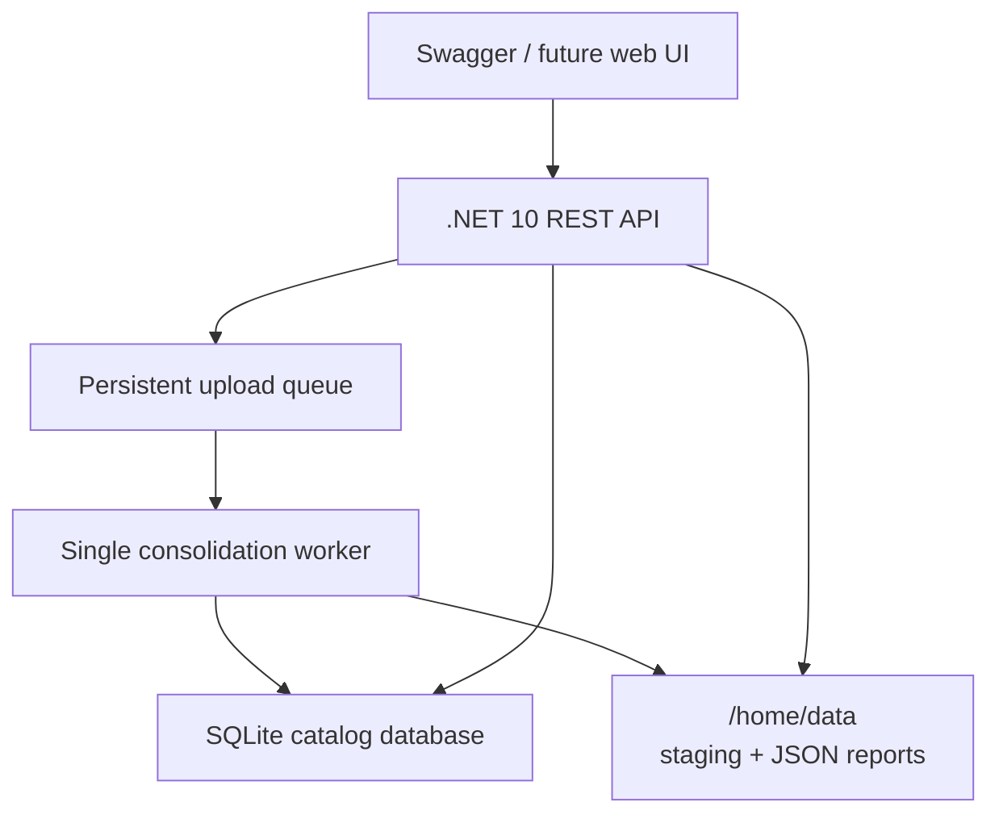
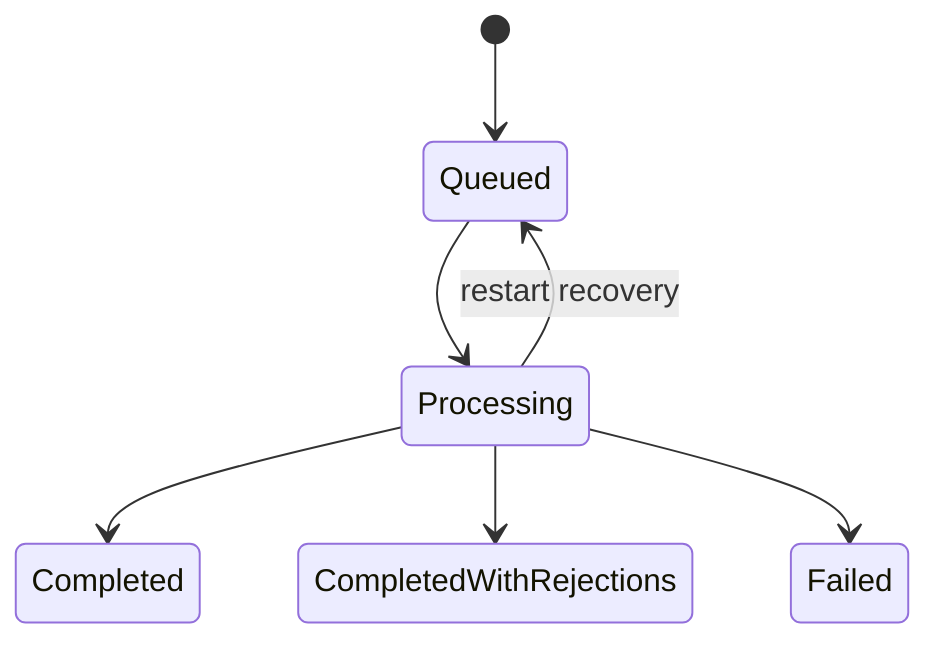

# Marketplace Catalog Consolidator - Solution Design

## 1. Purpose

**Marketplace Catalog Consolidator** is a public, containerized .NET 10 REST API lab. It accepts a seller-product JSON file, consolidates each entry into the supplied SQLite catalog, records seller offers without duplicating canonical products, and emits an immutable JSON report for every upload attempt.

GitHub repository: `MarketplaceCatalogConsolidator`

## 2. Scope and deployment

- Azure App Service Linux F1, West Central US.
- Docker image running a .NET 10 REST API.
- SQLite remains the catalog data store.
- Swagger/OpenAPI remains publicly available for reviewers.
- The catalog, upload history, staging files, and reports use persistent storage beneath `/home/data`.
- The application runs as one instance with one serialized consolidation worker. SQLite supports one writer at a time.



## 3. API contract

Every REST endpoint uses URL-segment versioning. The initial release is `v1`; breaking changes introduce `v2` without changing `v1` behavior.


| Endpoint                                | Purpose                                 | Access  |
| ----------------------------------------- | ----------------------------------------- | --------- |
| `POST /api/v1/uploads`                  | Accept and queue one JSON upload        | API key |
| `GET /api/v1/uploads`                   | List upload attempts                    | Public  |
| `GET /api/v1/uploads/{uploadId}/status` | Upload metadata and item outcomes       | Public  |
| `GET /api/v1/uploads/{uploadId}/report` | Download the immutable JSON report      | Public  |
| `GET /api/v1/catalog`                   | Query the consolidated catalog          | Public  |
| `GET /api/v1/health`                    | Process liveness                        | Public  |
| `GET /api/v1/ready`                     | SQLite and persistent-storage readiness | Public  |

### 3.1 Upload endpoint

`POST /api/v1/uploads` accepts `multipart/form-data`.


| Input             | Rule                                                           |
| ------------------- | ---------------------------------------------------------------- |
| `file`            | Required JSON file, UTF-8, strictly smaller than 500,000 bytes |
| `Idempotency-Key` | Required RFC 4122 UUID v4                                      |
| `X-Api-Key`       | Required secret, configured only in Azure App Service settings |

The response is `202 Accepted` and contains `uploadId`, current state, display filename, and SHA-256, with a `Location` header pointing to the live public status endpoint. Milestone 6 implements every route in the API table; only POST requires an API key. See the root solution design and README for the current public response contracts.

The same idempotency key and file SHA-256 return the existing upload rather than creating a second attempt. Reusing the key with another file returns `409 Conflict`.

### 3.2 Catalog endpoint

```text
GET /api/v1/catalog?category=&brand=&name=&sellerName=&page=1&pageSize=25
```

The endpoint returns canonical products, their seller offers, and pagination metadata. Filters ignore case, accents, and repeated whitespace; they never modify stored values. Category, brand, and seller name match whole values; name matches a literal substring. Products order by ID ascending and appear once regardless of seller count. A seller filter restricts returned offers to that seller. Page sizes default to 25 (50 for status items), with maximum 100. Upload history orders by start instant descending then ID descending. Reports verify durable metadata and SHA-256 before returning exact immutable JSON bytes; health performs no I/O and readiness probes SQLite and temporary storage writes.

### 3.3 Error response

```json
{
  "traceId": "guid",
  "code": "invalid_json",
  "message": "The uploaded file is not a valid product-entry array."
}
```

The `traceId` appears in structured logs and in the final report.

## 4. Data model

The supplied database starts with 975 `Product` rows and an empty `SellerProduct` table. The design preserves these tables and evolves the schema through forward-only migrations.

### 4.1 Catalog tables

```text
Product
- Id                  INTEGER primary key
- Name                TEXT not null
- Brand               TEXT null
- Category            TEXT null
- NormalizedName      TEXT not null
- NormalizedBrand     TEXT null
- NormalizedCategory  TEXT null

SellerProduct
- Id                  INTEGER primary key
- SellerName          TEXT not null
- ProductId           INTEGER not null, foreign key to Product.Id
- SellerProductId     TEXT not null
- SourceFingerprint   TEXT not null
- CreatedAtUtc        TEXT not null
- UNIQUE (SellerName, SellerProductId)
```

`SellerProduct.SellerProductId` changes from `INTEGER` to `TEXT` because the source JSON uses GUID-shaped string IDs. An index on `(NormalizedBrand, NormalizedName, NormalizedCategory)` supports strict product lookup.

When cleaned brand or category is `NULL`, the entry cannot match an existing product. This intentionally prevents unsafe merges based on incomplete identity.

### 4.2 Upload and audit tables

```text
Upload
- Id, IdempotencyKey, FileName, FileHash
- StagedFilePath, ReportFilePath
- Status, StartedAtUtc, CompletedAtUtc
- ReceivedCount, ApprovedCount, CleanedCount, RejectedCount
- TraceId, FailureCode, FailureMessage

UploadItem
- UploadId, SourceIndex, SourceProductId
- RawSellerName, RawName, RawBrand, RawCategory
- CleanedSellerName, CleanedName, CleanedBrand, CleanedCategory
- Status, ActionTaken, MatchedProductId
- UNIQUE (UploadId, SourceIndex)

`SchemaMigration` records each applied forward-only schema change by migration ID and UTC timestamp. A working database is copied from the immutable starter asset under the configured data root before migrations are applied.
```

`UploadItem` supports the status endpoint while processing. The external report is an immutable projection of the completed upload.

## 5. Upload lifecycle and recovery



1. Stream the request to a temporary file while enforcing the size limit.
2. Calculate a SHA-256 digest.
3. Atomically move the file to `/home/data/uploads/{uploadId}.json`.
4. Insert an `Upload` record with state `Queued`.
5. A single worker claims one queued upload transactionally.
6. Process each source entry in its own SQLite transaction.
7. On application restart, return incomplete `Processing` uploads to `Queued`; committed `UploadItem` rows are not processed again.
8. Generate the report to a temporary file and atomically rename it to `/home/data/reports/{uploadId}.json`.
9. Mark the upload terminal only after report generation succeeds.
10. Delete the staged source JSON after final report creation. Keep reports according to the lab retention policy.

If persistent storage cannot safely accept a new upload, return `507 Insufficient Storage`.

## 6. Consolidation policy

The source entry contract is:

```json
{
  "Id": "a1b2c3d4-e5f6-4a5b-8c9d-0e1f2a3b4c5d",
  "SellerName": "MegaStore",
  "Name": "Smartphone Galaxy S23",
  "Brand": "Samsung",
  "Category": "Electronics"
}
```

For each entry:

1. Validate required fields and a GUID-shaped source `Id`.
2. Apply the agreed suspicious-SQL-input business rule; every SQL operation remains parameterized regardless.
3. Trim fields and collapse internal whitespace.
4. Normalize case and remove accents for comparison.
5. Clean category alias `Photo` to `Photography`.
6. Resolve brand and category against values known in `Product`; an unknown value becomes `NULL`.
7. Strictly match normalized `Brand + Name + Category` only when all three normalized fields are present.
8. If matching succeeds, add the seller offer for the existing product.
9. If matching fails, create a new product with the cleaned values and add the seller offer.
10. Use `(SellerName, SellerProductId)` to detect a repeated seller source entry. A repeat with different content is a conflict.

### 6.2 SQL-control-sequence validation

All database operations use parameterized SQL independently of this validation rule. As a demonstrative business-validation policy, reject a text field if it contains a semicolon followed by a SQL keyword (`SELECT`, `INSERT`, `UPDATE`, `DELETE`, `DROP`, `ALTER`, `CREATE`, `PRAGMA`, `ATTACH`, `DETACH`, `UNION`, `EXEC`, or `EXECUTE`), or if it contains a SQL comment marker (`--`, `/*`, or `*/`) together with one of those keywords. Ordinary apostrophes and punctuation alone are accepted. A rejection names the field, for example: `Brand contains a suspicious SQL control sequence`.

### 6.1 Outcome rules


| Situation                                 | Status   | Action taken                             |
| ------------------------------------------- | ---------- | ------------------------------------------ |
| Valid new product                         | Approved | Created product and linked seller        |
| Valid cross-seller duplicate              | Approved | Linked seller to existing product        |
| Cleaned new product                       | Cleaned  | List transformations; created and linked |
| Cleaned cross-seller duplicate            | Cleaned  | List transformations; linked existing    |
| Same seller/source ID, same content       | Rejected | Duplicate source entry                   |
| Same seller/source ID, changed content    | Rejected | Source-ID conflict                       |
| Invalid data or suspicious SQL-like value | Rejected | Validation/security reason               |

`Approved` and `Cleaned` describe input quality, not whether the product already existed. A legitimate duplicate from another seller is an intended marketplace outcome.

## 7. JSON report

Every upload attempt produces one standalone JSON report outside SQLite, including successful, rejected, partial, and failed attempts.

```json
{
  "uploadId": "guid",
  "fileName": "ProductEntry.json",
  "startedAtUtc": "2026-09-29T03:00:00Z",
  "completedAtUtc": "2026-09-29T03:00:02Z",
  "status": "CompletedWithRejections",
  "summary": {
    "received": 269,
    "approved": 250,
    "cleaned": 15,
    "rejected": 4
  },
  "items": [
    {
      "id": "source-guid",
      "sellerName": "MegaStore",
      "name": "Smartphone Galaxy S23",
      "brand": "Samsung",
      "category": "Electronics",
      "status": "Approved",
      "actionTaken": "Linked seller MegaStore to existing product 2."
    }
  ]
}
```

Each cleaned item names the changed field and shows before/after values. The report path and SHA-256 are stored in `Upload`; the report body remains a file artifact.

## 8. Security and operations

- Public read endpoints and public Swagger make the assessment easy to review.
- `POST /api/v1/uploads` requires `X-Api-Key`; the secret is never committed, logged, included in reports, or passed in a query string.
- The API key comparison uses a constant-time comparison.
- Milestone 7 uses separate fixed-window policies: 5 uploads/minute and 120 public reads/minute per connection peer, no queue, with standard `429` envelopes and retry metadata. Forwarded-IP headers are not trusted. Startup validates credentials and storage configuration; safe global errors/logs, bounded bodies, and Swagger-compatible security headers are implemented. See the root design and README for operational details.
- Use HTTPS only.
- Run the Docker image as a non-root user.
- Use structured logs with `traceId`, `uploadId`, and source index.
- `GET /api/v1/ready` validates SQLite, staging, and report-directory writability.
- Back up the supplied SQLite database before the first forward-only migration.

## 9. Test proof

The automated suite must prove:

- Migration preserves the starter catalog's 975 products.
- `Photo` normalizes to `Photography`.
- Spacing and accent normalization work as specified.
- Cross-seller duplicates link without creating another canonical product.
- Suspicious SQL-like input is rejected and cannot execute SQL.
- The SQL-control-sequence policy rejects keyword-bearing control sequences while accepting ordinary apostrophes and punctuation.
- Reusing an idempotency key returns the original upload; reusing it with another file returns `409 Conflict`.
- Same-seller source-ID conflicts are rejected.
- Concurrent requests queue safely.
- Restart recovery resumes without duplicate processing.
- Every terminal upload generates exactly one valid JSON report.

## 10. Delivery standards

- `.NET 10`, Dockerfile baseline, Swagger/OpenAPI, and GitHub Actions build/test/format/secret scanning. Image verification remains deferred to deployment.
- Unit tests for normalization and policies; integration tests against SQLite.
- Seed database and supplied JSON fixture.
- README with assumptions, architecture, local run, Azure deployment, API usage, and Swagger validation walkthrough.
- Changes use feature branch -> PR -> user review -> user merge to main. The user performs all merges. CI uses a pinned native scanner without secrets or Python.
